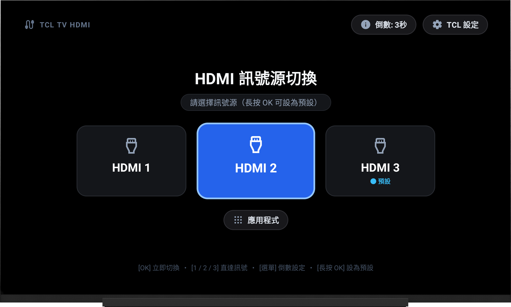
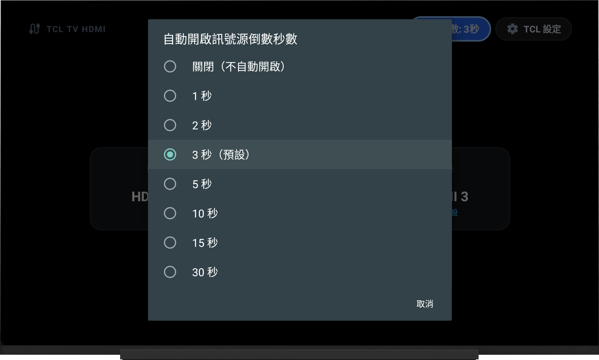
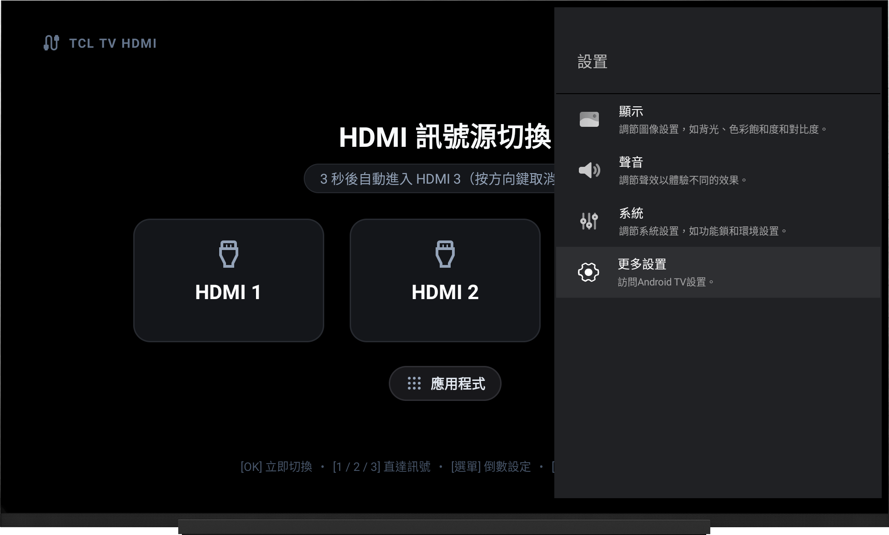
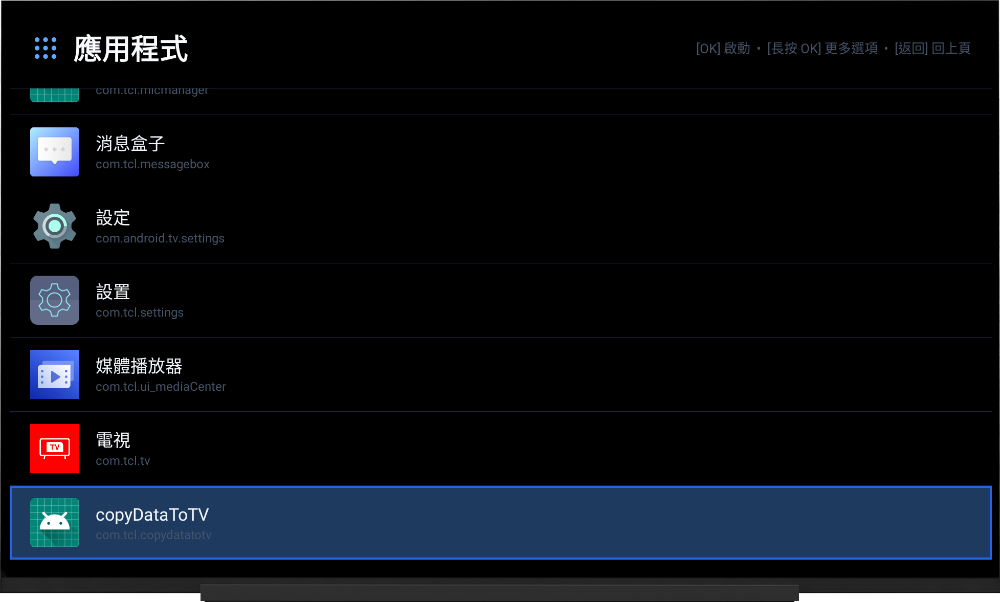
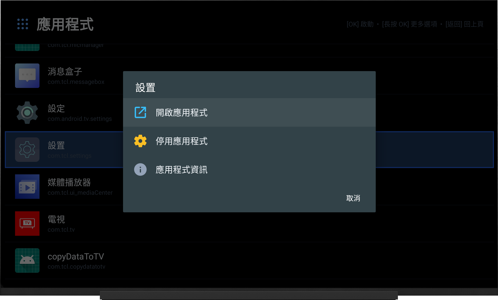
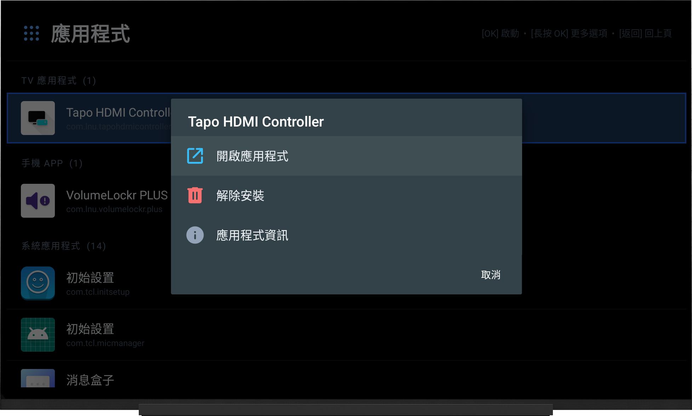

# TCL Android TV HDMI 1 / 2 / 3 GUI Launcher

<p align="left">
  <a href="README.md">English</a> | <b>繁體中文</b>
</p>

> **專為「把 TCL 電視當純顯示器用」的發燒友與極簡主義者打造。**  
> 徹底擺脫 TCL 原廠臃腫慢速、充斥推薦廣告的系統首頁；開機微秒級直達外接裝置（Apple TV / PS5 / 電視盒 / 藍光播放器），讓電視回歸純粹頂級螢幕！

---

## 為什麼需要這個專案？（核心痛點與使用場景）

### 誰最適合使用？
如果你符合以下任一特徵，這個 Launcher 就是為你量身打造的：
- **純外接訊號源主義者**：日常主力都是外接設備，內建的智慧電視系統對你來說只是個「面板控制器」。
  - 🍏 **Apple TV 4K** — 日常串流追劇、電影觀影主力
  - 🎮 **PlayStation 5 (PS5) / Xbox Series X / Switch** — 次世代 4K HDR 遊戲娛樂
  - 📺 **Android TV / Google TV 盒子**（Chromecast with Google TV、NVIDIA Shield 等）
  - 💿 **4K UHD 藍光 / DVD 播放機** 或 **家庭劇院擴大機 (AV Receiver)**
- **厭惡內建首頁的臃腫與廣告**：TCL 原廠 Launcher 開機載入緩慢、首頁塞滿不需要的線上影音推薦、佔用有限的系統記憶體。
- **想要「開機即用」的直覺體驗**：開啟電視後，希望像傳統電視或高階顯示器一樣，幾秒鐘內自動跳轉到最常看的訊號源（如 Apple TV），不必拿著遙控器在選單裡點來點去。
- **多設備切換要求快速極致**：家裡同時接了 PS5 與 Apple TV，希望按個數字鍵 `1` 或 `2` 就能瞬間無縫切換，不用呼叫繁瑣的輸入來源選單。

---

## 最佳劇院外接配置範例

```
                 ┌─────────────────────────────────┐
                 │    TCL 4K QLED / Mini-LED 電視  │
                 │   (純顯示器模式 Pure Monitor)   │
                 └────────────────┬────────────────┘
                                  │
      ┌───────────────────────────┼───────────────────────────┐
      │                           │                           │
  [ HDMI 1 ]                  [ HDMI 2 ]                  [ HDMI 3 (eARC) ]
      │                           │                           │
      ▼                           ▼                           ▼
🎮 PlayStation 5            📺 藍光播放機 / Switch       🍏 Apple TV 4K / 擴大機
(開機按數字鍵 1 直達)        (開機按數字鍵 2 直達)       (設為預設：開機 3 秒自動進入)
```

- **預設場景**：開機後，倒數 3 秒（可自訂）自動進入 **HDMI 3 (Apple TV 4K)**，完全免按任何按鍵。
- **遊戲場景**：想打電動時，遙控器直接按下數字鍵 `1`，微秒級直達 **HDMI 1 (PS5)**。
- **音訊與畫質調校**：右上角一鍵直達 TCL 原生影像與音效設定 (`com.tcl.settings`)，免去原生 Launcher 繁瑣層級。

---

## 核心亮點特色

1. **開機自動倒數直達**：
   - 支援自訂倒數秒數：`關閉`、`1s`、`2s`、`3s（預設）`、`5s`、`10s`、`15s`、`30s`。
   - 開機或按下 Home 鍵，倒數結束即微秒級自動切換至預設訊號源。
   - 倒數期間任意輕按方向鍵（D-pad）即可暫停倒數，從容選取其他訊號源。
2. **遙控器數字鍵極速跳轉**：
   - 遙控器按下 `1` / `2` / `3`，立即直達對應 HDMI 埠，切換無延遲。
3. **長按 OK 鍵自由設定預設訊號源**：
   - 在任一 HDMI 卡片上「長按 OK 鍵」，即可將該埠標記為開機預設訊號源。
4. **極致輕量、零後台常駐、零 GC 負載**：
   - **混淆後僅約 9.0 KB**，全純程式碼 View 樹，0 XML 解析開銷、0 反射。
   - 倒數計時熱路徑達成 **0 記憶體配置 (0 GC)**，絕不卡頓。
   - 切換訊號後立即執行 `finishAndRemoveTask()` 退出並釋放所有記憶體，將 TV 晶片算力 100% 留給 4K 影像解碼與音效處理。
5. **純黑電視專用介面 (Pure Black #000000)**：
   - 專為暗室家庭劇院與 OLED / QLED 局部控光最佳化，絕無刺眼白色閃爍。
6. **多國語言介面 (English / 繁體中文 / 簡體中文)**：
   - 依電視系統語言自動適配，無論全英環境或繁簡中文皆完美顯示。
7. **完整保留必要電視功能**：
   - **TCL 設定快捷鍵**：右上角獨立按鈕，一鍵開啟 TCL 原廠電視畫質/音效設定頁。
   - **輕量應用程式抽屜 (App Drawer)**：若偶爾需開啟內建智慧電視 App，內建極速清單，支援 TV/手機側載分類、最近使用與長按解除安裝/停用。

---

## 畫面截圖 (Screenshots)

| 主畫面（HDMI 訊號源切換） | 倒數秒數設定對話框 |
|:---:|:---:|
|  |  |
| **呼叫 TCL 原生設定** | **應用程式列表（App Drawer）** |
|  |  |
| **系統應用管理（長按 OK）** | **第三方應用管理（長按 OK）** |
|  |  |

---

## 實測驗證裝置 (Tested Device)

- **測試機型**：**TCL 65C715**（C715 系列 65 吋 4K QLED Android TV）
- **機芯平台 (Chassis Platform)**：**RTD2851 / R851T02**（韌體版本識別前綴如 `V8-R851T02-LF1...`）
  > [!NOTE]
  > **關於 R851T02 平台：**  
  > `R851T02` 是 TCL 廣泛應用於多款主力 Android TV（涵蓋 C715、P715、P615、S434 等系列）的晶片與主機板架構（Realtek RTD2851 方案）。凡是搭載 **R851T02 機芯架構** 的機型，其底層電視訊號輸入服務（`com.tcl.tvinput`）與 Passthrough 直通架構規格均高度統一。
- **機型規格摘要**：
  - **螢幕面板**：65" 4K UHD (3840 × 2160) 量子點 QLED、60Hz、支援 Dolby Vision / HDR10+
  - **HDMI 配置**：共 3 組實體 HDMI 2.0 端子（支援 HDCP 2.2、HDMI-ARC / CEC）
  - **處理器與記憶體**：4 核心 ARM Cortex-A55 處理器、2 GB RAM / 16 GB ROM
  - **系統環境**：Android TV 9.0 / Android TV 11
  - **實測結果**：HDMI 1 ~ 3 訊號源微秒級切換、倒數計時自動跳轉、開機預設、遙控器按鍵（數字鍵/選單鍵/設定鍵）均 100% 驗證通過。

## 實體裝置訊號源對照表（R851T02 / C715 實測驗證）

| 訊號源 | Port | Hardware ID | 完整 TvInput ID |
|---|---|---|---|
| **HDMI 1** | 1 | `1413744128` | `com.tcl.tvinput/.passthroughinput.TvPassThroughService/HW1413744128` |
| **HDMI 2** | 2 | `1413744384` | `com.tcl.tvinput/.passthroughinput.TvPassThroughService/HW1413744384` |
| **HDMI 3** | 3 | `1413744640` | `com.tcl.tvinput/.passthroughinput.TvPassThroughService/HW1413744640` |

### ADB 測試各訊號源切換

```bash
# 切換 HDMI 1
adb shell am start -a android.intent.action.VIEW \
  -d "content://android.media.tv/passthrough/com.tcl.tvinput%2F.passthroughinput.TvPassThroughService%2FHW1413744128"

# 切換 HDMI 2
adb shell am start -a android.intent.action.VIEW \
  -d "content://android.media.tv/passthrough/com.tcl.tvinput%2F.passthroughinput.TvPassThroughService%2FHW1413744384"

# 切換 HDMI 3
adb shell am start -a android.intent.action.VIEW \
  -d "content://android.media.tv/passthrough/com.tcl.tvinput%2F.passthroughinput.TvPassThroughService%2FHW1413744640"
```

---

## 遙控器操作指南 (Remote Control Shortcuts)

| 按鍵 | 操作效果 |
|---|---|
| **方向鍵 (D-Pad)** | 移動卡片焦點；在倒數進行時按任意方向鍵可**取消自動跳轉** |
| **OK / 確認鍵** | 立即切換至當前焦點選取的 HDMI 訊號源 |
| **長按 OK 鍵** | 將當前 HDMI 卡片設為**開機預設訊號源** |
| **數字鍵 `1` / `2` / `3`** | **秒切快捷鍵**：無視當前焦點，立即切換至對應 HDMI 1 / 2 / 3 |
| **選單鍵 (MENU)** | 開啟「自動開啟訊號源倒數秒數」設定對話框 |
| **設定鍵 (SETTINGS)** | 一鍵呼叫 TCL 原生設定選單 (`com.tcl.settings`) |
| **返回鍵 (BACK)** | 應用程式清單中返回主畫面 |

---

## 安裝與設為預設桌面教學

### 步驟 1：建置 Debug 或 Release APK

```bash
# 建置 Debug APK
./gradlew assembleDebug

# 或建置極限混淆 Release APK (僅 ~9.0 KB)
./gradlew assembleRelease
```

### 步驟 2：開啟電視 ADB 開發者模式並安裝
1. 在電視系統設定中，前往「關於」-> 連續點擊「版本號碼 (Build Number)」7 次以啟用開發人員選項。
2. 在「開發人員選項」中開啟「USB 偵錯」或「網路偵錯」。
3. 使用電腦終端機連線並安裝：

```bash
# 透過 Wi-Fi ADB 連線電視（以電視 IP 為準）
adb connect 192.168.1.xxx:5555

# 安裝 APK
adb install -r app/build/outputs/apk/debug/app-debug.apk
```

### 步驟 3：設為預設 TV Launcher（首頁啟動器）

```bash
# 指派本 App 為系統預設 Launcher
adb shell cmd package set-home-activity com.lnu.tclhdmilauncher/.MainActivity
```
*按遙控器「Home 首頁鍵」，系統即會以本 App 作為純淨 HDMI 啟動桌面。*

### 步驟 4：停用 TCL 原生臃腫 Launcher（選用進階步驟，追求極限純淨）
若希望杜絕原生 Launcher 任何後台喚醒與資源佔用，可安全停用（非刪除，日後可無損還原）：

```bash
# 1. 查詢 TCL 內建 Launcher 套件名稱
adb shell pm list packages | grep -i launcher

# 2. 停用 TCL 內建 Launcher（以查詢到的套件名為準）
adb shell pm disable-user --user 0 <tcl.launcher.package.name>
```

> [!TIP]
> **隨時可無損還原：**  
> 若日後需要換回 TCL 原廠桌面，只需執行：
> ```bash
> adb shell pm enable <tcl.launcher.package.name>
> adb shell cmd package clear-preferred-activities com.lnu.tclhdmilauncher
> ```

---

## 運作原理架構

```
電視開機 / 睡眠喚醒 / 按 Home 鍵
                │
                ▼
      MainActivity.onCreate()
                │
        ┌───────┴───────┐
        ▼               ▼
  [無人操作 (預設)]  [用戶操作]
        │               │
   倒數 N 秒結束   遙控器按 1/2/3 或 OK
        │               │
        └───────┬───────┘
                │
                ▼
TvContract.buildChannelUriForPassthroughInput(HDMI_INPUT_ID)
                │
                ├─ 成功 ──► startActivity(Intent(ACTION_VIEW, uri))
                │             │
                │             ▼
                │        finishAndRemoveTask()
                │       (記憶體 100% 釋放，TV 零常駐)
                │
                └─ 冷開機硬體未就緒
                      │
                      ▼
                  Handler.postDelayed(1500ms)
                      │
                      ▼
                  重試並完成跳轉
```

**關鍵設計原則：**
- `finishAndRemoveTask()` — 切換成功後即刻終止 Activity，不佔用背景記憶體。
- `excludeFromRecents="true"` — 不污染多工清單。
- `singleTask` — 防止多重實例堆疊。
- 非阻塞 Handler 重試 — 冷開機 TV 底層服務初始化時自動容錯。

---

## 技術規格

| 項目 | 規格值 |
|---|---|
| 版本 | v1.0.3 (`versionCode 5`) |
| `minSdk` | 25 (Android 7.1) |
| `targetSdk` | 37 |
| `compileSdk` | 37 |
| AGP | 9.2.1 |
| Gradle | 9.4.1 (相容 Java 25 JBR / Android Studio Ladybug+) |
| 第三方依賴 | **0 依賴**（100% Android SDK 原生呼叫） |
| 主題規範 | **強制純黑 Pure Black (#000000)**，禁用 ForceDark |
| 國際化 | 支援 English、繁體中文 (TW/HK)、簡體中文 (CN) |
| Release 體積 | R8 fullMode 混淆壓縮後僅約 **9.0 KB** |
| 背景記憶體 | 跳轉後呼叫 `finishAndRemoveTask()`，**0 背景常駐** |
